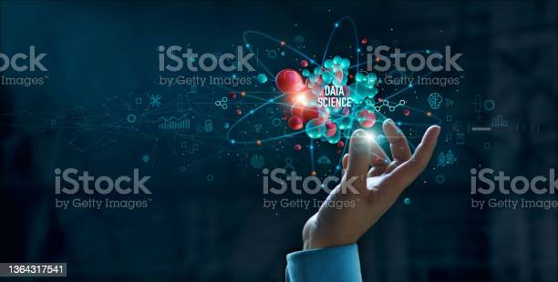

### Hello, I am Mercy Milkah Gathoni Njogu! 👋

- 🔭 I’m currently working on DevPost AWS Health AI challenge
- 🌱 I’m currently learning Android Studio
- 👯 I’m looking to collaborate on AWS
- 🤔 I’m looking for help with Computer Vision
- 💬 Ask me about Machine Learning, AI, or any data science related stuff
- 📫 How to reach me: email: milkahgathonim@gmail.com OR milky.mercy26@gmail.com, [Linkedin](https://www.linkedin.com/in/mercy-milkah-gathoni-673448b6/)
- 😄 Pronouns: She, Her
- ⚡ Fun fact: I'm a drummer in Gospel rock band 
-->

# This is my Data Science Portfolio
In this portfolio you will find data science projects with problems that many companies are trying to solve nowadays. All projects were developed by me. Datasets were obtained from Kaggle website.

Please contact me on [Linkedin](https://www.linkedin.com/in/mercy-milkah-gathoni-673448b6/) if you are looking to hire an entry level data scientist or data analyst.

In each project was done an end-to-end project, including the following sequence of steps:
- Introduction of the project, giving all the necessary information for the understanding of the project, and a description of the variables used.
- Import of libraries used on the projects.
- Import of the data and getting some basic information of the dataset.
- Data cleaning of the dataset, checking missing values and outliers.
- EDA to plot some charts of the variables, getting useful insights of the problem with the information obtained from the dataset.
- Feature Engineering to adjust some information shown on the dataset to make it possible to run a machine learning algorithm and also doing the feature selection.
- Presets of the model to help the running of the machine learning algorithm, choose of the metrics and fuctions for better visualization of the results given from the models.
- Machine Learning Models, with a list of all algorithm that it will be tested on project and it will be chosen the one with the highest score of the metrics chosen.
- Conclusion of project, summarization of all useful information obtained on project and what action need to be taken to improve the results and revenue of the company.
